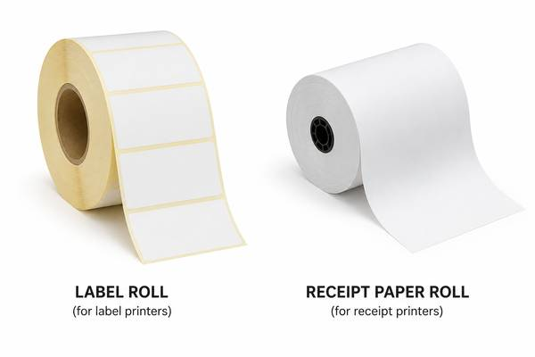

# ThermalLabeler

**ThermalLabeler** — Утилита для печати на термопринтерах из Android без привязки к конкретному производителю и без фирменных драйверов.

  

Утилита для печати ThermalLabeler — это приложение для печати с устройств Android на совместимых термопринтерах без привязки к конкретному производителю и без драйверов.
 Важно: приложение предназначено исключительно для работы с термопринтерами, поддерживающими режимы TSPL и/или ESC/POS.
 TSPL используется для печати на самоклеящихся этикетках, а ESC/POS — для печати на рулонной термобумаге (чеки, квитанции, талоны и другие документы).
 Программа не предназначена для обычных офисных, струйных, лазерных и других типов принтеров и не работает с ними.
 Поддерживаются только термопринтеры с совместимым интерфейсом печати TSPL и/или ESC/POS.
 Приложение выступает в качестве моста между Android и термопринтером, обеспечивая полный контроль над печатью этикеток и документов на рулонной термобумаге там, где стандартные решения не работают или создают препятствия.
 Оно решает практическую задачу: как распечатать с телефона или планшета этикетку либо документ на рулонной термобумаге на совместимом термопринтере.
 Перед печатью содержимое файла автоматически преобразуется в растровый макет, масштабируется до фактического размера этикетки или ширины рулона и подготавливается с учетом ориентации, полей и параметров принтера.
 ThermalLabeler получает данные для печати, корректно масштабирует их до реальных размеров носителя и обрабатывает в соответствии с выбранным режимом печати (TSPL или ESC/POS).
 Программа является мостом между Android и термопринтером и даёт полный контроль над печатью этикеток там, где стандартные решения не работают или мешают.
 Приложение решает практическую задачу: как напечатать этикетку или содержимое чека с телефона или планшета на обычном термопринтере.
 
Перед печатью содержимое файла автоматически преобразуется в растровый макет.
Далее, в случае печати этикетки, масштабируется под ее реальные размеры и подготавливается с учётом ориентации, отступов и параметров принтера.
Если же печать происходит на чековом принтере, то полученный растровый макет масштабируется по ширине бумаги.

---

## Шаблоны этикеток

В программе можно создавать и сохранять несколько шаблонов этикеток с разными размерами и параметрами печати.

Каждый шаблон содержит набор свойств:

- ширина и высота этикетки  
- зазор между этикетками (gap)  
- смещение  
- ориентация и поворот  
- параметры выравнивания  
- препринт (непечатаемая область)  

Созданные шаблоны используются повторно и позволяют быстро переключаться между разными типами этикеток без повторной настройки.

---

## Прямая печать

Печать выполняется напрямую:

- через Bluetooth  
- через USB  
- через Wi-Fi  

Приложение поддерживает открытие файлов (PDF, HTML, изображения) напрямую из системы Android.

При выборе «Открыть с помощью» или «Поделиться» файл автоматически загружается в приложение и подготавливается к печати.

---

## Интеграция с Android PrintService

Программа работает как Android PrintService:

- доступна из стандартного диалога «Печать»  
- может использоваться любыми приложениями (торговые программы, браузеры, PDF-viewer и т.п.)

---

## Поддерживаемые форматы файлов

Программа позволяет открывать и печатать этикетки из следующих типов файлов:

- **PDF** — документы и макеты, полученные из других приложений или систем  
- **HTML** — страницы и шаблоны, включая автоматически сформированные отчёты и ценники  
- **Изображения** — PNG, JPG и другие распространённые форматы  

---

## История печати

Программа сохраняет историю выполненных заданий печати.

Для каждого задания фиксируются:

- исходный файл  
- параметры печати  

Из истории можно повторно открыть задание и выполнить повторную печать без необходимости заново выбирать файл или настраивать параметры.

---

## Чем отличается от «обычных» решений

- нет эмуляции A4  
- нет привязки к одному бренду принтера  
- точная печать «этикетка в этикетку»  
- контроль всего пайплайна печати  
- подходит для складов, магазинов, логистики и маркировки  

---

## Типовые сценарии использования

- печать ценников и штрихкодов  
- печать складских и транспортных этикеток  
- печать из торговых программ  
- печать из самописных Android-приложений  
